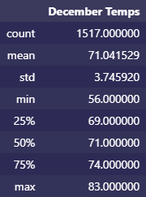

# Surf's Up Weather Analysis

## Overview

This project used SQLAlchemy to connect to a SQL database and filter and load Hawaiian weather data into a Jupyter Notebook file. Flask was also used to create an API front-end that could query the database for measurement data.

## Results

 

* The difference in mean temperature between the two months is less than 5 F.
* December had a minimum temperature 8 F lower than June.
* December had a maximum temperature 2 F lower than June.

## Summary

Hawaii appears to have relatively consistent temperatures year-round.

To better understand the weather patterns that would affect the business of a Hawaiian surf shop, it would be better to filter results from only weather stations that are at sea level and close to the shore.

    jun_query = session.query(Measurement.date, Measurement.tobs).\
        filter(extract('month', Measurement.date) == 6).\
        filter(Measurement.station == 'USC00519281'\
        or Measurement.station == 'USC00514830').all()

<!-- LINE BREAK -->

    dec_query = session.query(Measurement.date, Measurement.tobs).\
        filter(extract('month', Measurement.date) == 12).\
        filter(Measurement.station == 'USC00519281'\
        or Measurement.station == 'USC00514830').all()